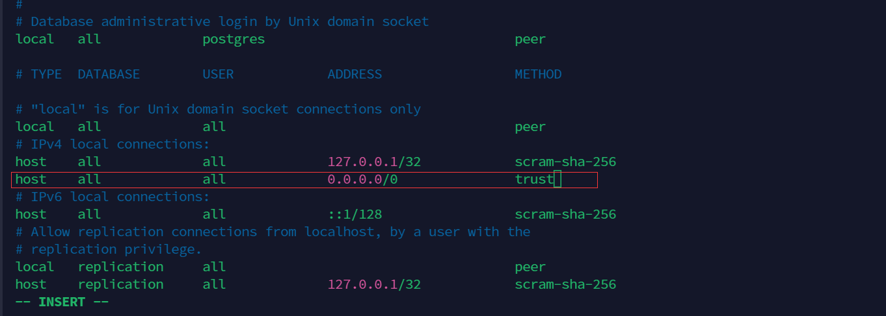

## 安装 Postgres

```shell
apt update
apt install postgresql
```

## 配置 Postgres
### 登录 postgres
```shell
su postgres # 切换到postgres用户来登录postgres
psql
```

### 设置 postgres 用户密码
```shell
postgres=# ALTER USER postgres WITH PASSWORD 'xxxxxxxxxxx';
# ALTER ROLE
```

### 查看配置文件路径
```shell
postgres=# show config_file;
# /etc/postgresql/15/main/postgresql.conf
```

### 配置 pg_hba.conf 开放所有 v4 ip 登录
```shell
vim /etc/postgresql/15/main/pg_hba.conf
```


```conf
# pg_hba.conf
host    all             all             0.0.0.0/0               md5
```

### postgresql.conf 配置监听 *
```shell
vim /etc/postgresql/15/main/postgresql.conf
```


```conf
# postgresql.conf
listen_addresses = '*'  
```

### 重启 postgres
```shell
su root
systemctl restart postgresql
```

### 验证
```shell
psql -U postgres -h 127.0.0.1 
```


## 主从配置

### 主库配置

创建同步用户
```sql
CREATE ROLE replica login replication encrypted password 'replica';
```

修改 pg_hba.conf
```shell
vim /etc/postgresql/15/main/pg_hba.conf
```

添加配置
```conf
# pg_hba.conf
host    replication     replica         192.168.31.1/24         md5
```

修改 postgresql.conf
```
vim /etc/postgresql/15/main/postgresql.conf
```

修改以下内容
```conf
# postgresql.conf
full_page_writes = on
archive_mode = on  # 允许归档
wal_level = replica  # 写入WAL的级别(minimal:不能通过基础备份和wal日志恢复数据库; replica: 支持wal归档和复制; logical: 在replica级别添加了逻辑解码所需的信息)
max_wal_senders = 10 # 允许最多的流复制连接发送数量， 必须设置为非零值，且比备库数量多
wal_sender_timeout = 60s  # 设置流复制发送数据的超时时间
max_connections = 100  # 最大连接数量
max_wal_size = 4GB
min_wal_size = 2GB
```

重启
```shell
su root
systemctl restart postgresql
```

### 从库配置

清空从节点数据
```shell
su - postgres
cd /var/lib/postgresql/15/main
rm -rf *
```

将主库的基础数据复制到从库
```shell
pg_basebackup -D $PGDATA -Fp -Xstream -R -c fast -v -P -h <masta_ip> -U replica -W
```

输入上面创建的replica用户密码
```log
postgres@server-2:~/15/main$ pg_basebackup -D $PGDATA -Fp -Xstream -R -c fast -v -P -h 192.168.31.208 -U replica -W
Password: 
pg_basebackup: initiating base backup, waiting for checkpoint to complete
pg_basebackup: checkpoint completed
pg_basebackup: write-ahead log start point: 0/2000028 on timeline 1
pg_basebackup: starting background WAL receiver
pg_basebackup: created temporary replication slot "pg_basebackup_13273"
30506/30506 kB (100%), 1/1 tablespace                                         
pg_basebackup: write-ahead log end point: 0/2000100
pg_basebackup: waiting for background process to finish streaming ...
pg_basebackup: syncing data to disk ...
pg_basebackup: renaming backup_manifest.tmp to backup_manifest
pg_basebackup: base backup completed
postgres@server-2:~/15/main$ 
```

修改 postgresql.conf
```
vim /etc/postgresql/15/main/postgresql.conf
```

修改以下内容
```conf
# postgresql.conf
wal_level = replica  # 写入WAL的级别(minimal:不能通过基础备份和wal日志恢复数据库; replica: 支持wal归档和复制; logical: 在replica级别添加了逻辑解码所需的信息)
max_connections = 100  # 最大连接数量
hot_standby = on 
max_standby_streaming_delay = 30s  # 数据流备份的最大延迟时间
wal_receiver_status_interval = 10s  # 多久向主报告一次从的状态，当然从每次数据复制都会向主报告状态，这里只是设置最长的间隔时间
hot_standby_feedback = on  # 如果有错误的数据复制，是否向主进行反馈
```

重启
```shell
su root
systemctl restart postgresql
```

## 主从同步验证

### 查看同步状态信息

主节点
```shell
su - postgres
psql
```

执行查询
```log
postgres=# \x
Expanded display is on.
postgres=# 
postgres=# select * from pg_stat_replication;
-[ RECORD 1 ]----+------------------------------
pid              | 13307
usesysid         | 16389
usename          | replica
application_name | 15/main
client_addr      | 192.168.31.206
client_hostname  | 
client_port      | 47892
backend_start    | 2024-05-04 04:44:50.494288-04
backend_xmin     | 738
state            | streaming
sent_lsn         | 0/5000148
write_lsn        | 0/5000148
flush_lsn        | 0/5000148
replay_lsn       | 0/5000148
write_lag        | 
flush_lag        | 
replay_lag       | 
sync_priority    | 0
sync_state       | async
reply_time       | 2024-05-04 04:48:11.556358-04

postgres=# 
```